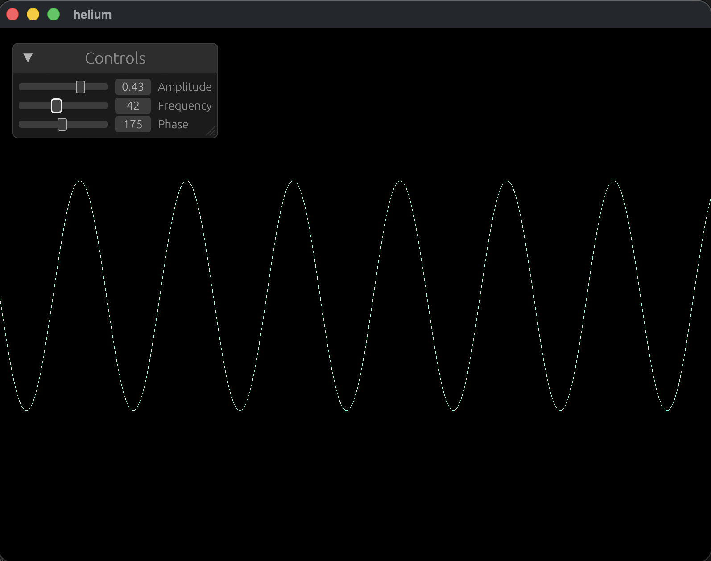

# `helium`

> A GPU-accelerated math object viewer built in Rust



## Technology Stack

| Component  | Crate(s)                     |
| ---------- | ---------------------------- |
| Windowing  | `winit`                      |
| GPU        | `wgpu`                       |
| UI overlay | `egui`                       |
| Math       | `glam`, `rustfft`, `ndarray` |

## Cross-Platform Targets

`helium` now has CI coverage for these targets:

- Desktop build: `x86_64-unknown-linux-gnu`
- Desktop build: `x86_64-pc-windows-msvc`
- Desktop build: `x86_64-apple-darwin`
- Desktop build: `aarch64-apple-darwin`
- Mobile compile check: `aarch64-apple-ios`
- Mobile compile check: `aarch64-apple-ios-sim`
- Mobile compile check: `aarch64-linux-android`
- Mobile compile check: `armv7-linux-androideabi`
- Mobile compile check: `x86_64-linux-android`

The workflow is at `.github/workflows/build-matrix.yml`.

## Local Build Commands

Install targets first:

```bash
rustup target add \
	x86_64-unknown-linux-gnu \
	x86_64-pc-windows-msvc \
	x86_64-apple-darwin \
	aarch64-apple-darwin \
	aarch64-apple-ios \
	aarch64-apple-ios-sim \
	aarch64-linux-android \
	armv7-linux-androideabi \
	x86_64-linux-android
```

Desktop release builds:

```bash
cargo build --release --target x86_64-unknown-linux-gnu
cargo build --release --target x86_64-pc-windows-msvc
cargo build --release --target x86_64-apple-darwin
cargo build --release --target aarch64-apple-darwin
```

Mobile compile checks:

```bash
cargo check --target aarch64-apple-ios
cargo check --target aarch64-apple-ios-sim
cargo check --target aarch64-linux-android
cargo check --target armv7-linux-androideabi
cargo check --target x86_64-linux-android
```

## Mobile Packaging Notes

- iOS packaging/signing must be done from Xcode (or `xcodebuild`) with an app host project.
- Android packaging/signing must be done with Android SDK/NDK + Gradle.
- This repository is now structured so the core viewer runtime can be reused by those native app hosts.

## Mobile Host Scaffolds

Scaffolded host projects are included under `mobile/`:

- Android host app: `mobile/android`
- iOS host app template: `mobile/ios`
- macOS host app template: `mobile/macos`

### Android Host

Prerequisites:

- Android Studio (SDK + NDK)
- `cargo-ndk` (`cargo install cargo-ndk`)

Build Rust libraries into Android `jniLibs`:

```bash
./scripts/mobile/build-android-libs.sh
```

Then open `mobile/android` in Android Studio and run/build the app.

### iOS Host

Prerequisites:

- Xcode command line tools
- `xcodegen` (`brew install xcodegen`)

Build Rust XCFramework:

```bash
./scripts/mobile/build-ios-xcframework.sh
```

Generate an Xcode project from template spec:

```bash
./scripts/mobile/generate-ios-project.sh
```

Then open `mobile/ios/Helium.xcodeproj` in Xcode and sign/build.

### macOS Host

Prerequisites:

- Xcode command line tools
- `xcodegen` (`brew install xcodegen`)

Build Rust XCFramework:

```bash
./scripts/mobile/build-macos-xcframework.sh
```

Generate a macOS Xcode project from template spec:

```bash
./scripts/mobile/generate-macos-project.sh
```

Then open `mobile/macos/Helium.xcodeproj` in Xcode and build/run.

### What This Verifies Today

- Rust artifacts are built and linked into native mobile hosts.
- Host UIs call a minimal Rust ABI function (`helium_ffi_ping`) to verify linkage.
- Native iOS/macOS projects can launch the Rust viewer runtime directly from app entrypoint.
